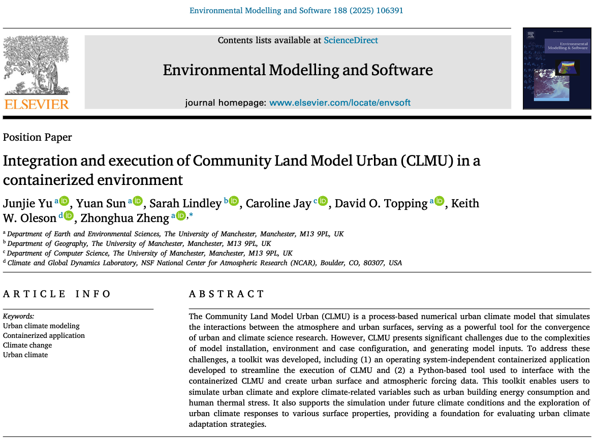

.. ctsmpy documentation master file, created by
   sphinx-quickstart on Tue Jan 23 16:49:22 2024.
   You can adapt this file completely to your liking, but it should at least
   contain the root `toctree` directive.

pyclmuapp: Integration and Execution of Community Land Model Urban (CLMU) in a Containerized Environment
========================================

|doi| |docs| |GitHub| |license| 

.. |doi| image:: https://zenodo.org/badge/DOI/10.5281/zenodo.14224043.svg
   :target: https://doi.org/10.5281/zenodo.14224043

.. |docs| image:: https://img.shields.io/badge/docs-pyclmuapp-brightgreen.svg
   :target: https://envdes.github.io/pyclmuapp/

.. |GitHub| image:: https://img.shields.io/badge/GitHub-pyclmuapp-brightgreen.svg
   :target: https://github.com/envdes/pyclmuapp
   
.. |license| image:: https://img.shields.io/badge/License-MIT-blue.svg
   :target: https://github.com/envdes/pyclmuapp/blob/main/LICENSE

pyclmuapp: Integration and Execution of Community Land Model Urban (CLMU) in a Containerized Environment

Contributors: `Junjie Yu <https://junjieyu-uom.github.io>`_, `Keith Oleson <https://staff.ucar.edu/users/oleson>`_, `Yuan Sun <https://github.com/YuanSun-UoM>`_, `David Topping <https://research.manchester.ac.uk/en/persons/david.topping>`_, `Zhonghua Zheng <https://zhonghuazheng.com>`_ (zhonghua.zheng@manchester.ac.uk)

If you use pyclmuapp in your research, please cite the following paper:

Yu, J., Sun, Y., Lindley, S., Jay, C., Topping, D. O., Oleson, K. W., & Zheng, Z. (2025). `Integration and execution of Community Land Model Urban (CLMU) in a containerized environment <https://doi.org/10.1016/j.envsoft.2025.106391>`_. Environmental Modelling & Software, 188, 106391. https://doi.org/10.1016/j.envsoft.2025.106391

.. code-block:: bibtex

      @article{YU2025pyclmuapp,
      title = {Integration and execution of Community Land Model Urban (CLMU) in a containerized environment},
      journal = {Environmental Modelling & Software},
      volume = {188},
      pages = {106391},
      year = {2025},
      issn = {1364-8152},
      doi = {https://doi.org/10.1016/j.envsoft.2025.106391},
      url = {https://www.sciencedirect.com/science/article/pii/S1364815225000751},
      author = {Junjie Yu and Yuan Sun and Sarah Lindley and Caroline Jay and David O. Topping and Keith W. Oleson and Zhonghua Zheng},
      }

.. toctree::
   :maxdepth: 1
   :caption: Overview

   notebooks/overview/overview.md
   notebooks/overview/installation.md

.. toctree::
   :maxdepth: 1
   :caption: Python: warmup

   notebooks/usp/warmup.ipynb

.. toctree::
   :maxdepth: 1
   :caption: Python: examples

   notebooks/usp/example1_usp_basic.ipynb
   notebooks/usp/example2_usp_global_warming.ipynb
   notebooks/usp/example3_usp_adaptation.ipynb

.. toctree::
   :maxdepth: 2
   :caption: Other usage

   notebooks/basic/basic_usage_inter.md
   notebooks/basic/basic_usage_cli.md

.. toctree::
   :maxdepth: 1
   :caption: Python: created input files

   notebooks/own/prepare_forcing_from_era5.ipynb
   notebooks/own/prepare_urbansurf_10evlurb.ipynb

.. toctree::
   :maxdepth: 1
   :caption: Spinup

   notebooks/usp/usp_spinup_mode.ipynb

.. toctree::
   :maxdepth: 1
   :caption: HPC

   notebooks/hpc/HPC.ipynb
   notebooks/hpc/singularity.rst
   

.. toctree::
   :maxdepth: 1
   :caption: Evaluation

   notebooks/val/urban_plumber_usp.ipynb

.. toctree::
   :maxdepth: 1
   :caption: API Reference

   pyclmuapp.rst

Indices and tables
==================

* :ref:`genindex`
* :ref:`modindex`
* :ref:`search`
