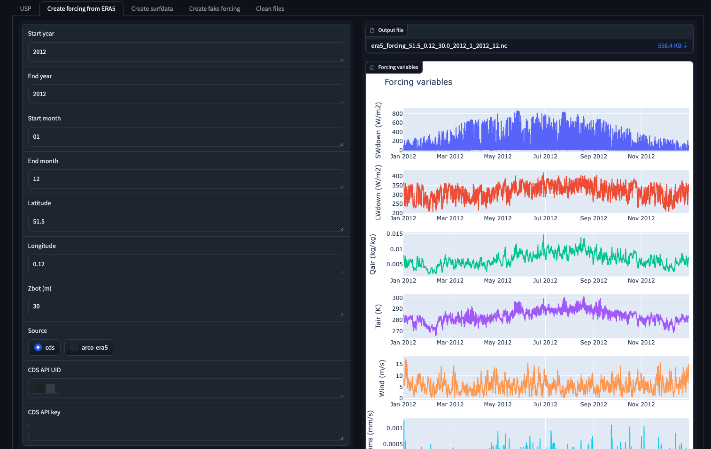
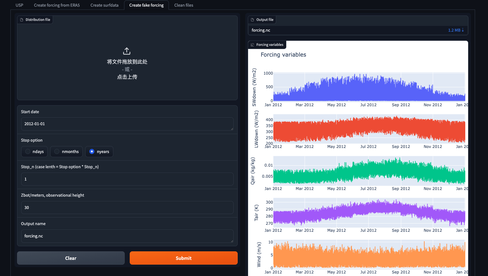

# Basic usage: Web interface
---

Step 1: Run pyclmuapp container

Open the terminal and input follow

```bash
docker pull envdes/pyclmuapp:1.0
docker run --hostname clmu-app -p 8080:7860 envdes/pyclmuapp:1.0
```

then copy http://localhost:8080 to your browser.

### 1 USP
Step 2: Run simulation by providing `surface data` and `forcing data`.

Click `Submit` button, and then get the result from the left. The `Output files` are the simulation output files location. The outputs are Netcdf file, which can be read using lots tools, including `Xarray` and `Netcdf4` Python package, Matlab, NCAR Command Language, HDFView, Panoply etc. The figures on the left were generated by Python.


Optional: Modify the urban surface or/and forcing and run simulations.


### 2 Create forcing from ERA5
Optional: Create forcing from ERA5 single level data.



### 3 Create surfdata
Optional: Create surface data.


### 4 Create fake forcing
Optional: Create fake forcing.



## Input Parameters
---

### 1 USP
- **Case name**: Case name, default is pyclmuapp
- **CLM surface data**: User surface data file, default is None If have the domain file, input the file path.
- **Forcing file**: User forcing file, default is None. If have the domain file, input the file path.
- **Run start date**: Start date, default is `2012-08-08`. 
- **Stop option**: Stop option, default is `ndays`, can be nyears, nmonths, ndays.
- **Stop_n**: Stop number, default is `1`. Case length is STOP_OPTION * STOP_N


Additional Inputs

- **surf_var**: Surface variable to modify, default is `None`. Can be one/some (use ','(withou space to seperate each)) of 'CANYON_HWR', 'HT_ROOF','THICK_ROOF','THICK_WALL',' WTLUNIT_ROOF','WTROAD_PERV','WIND_HGT_CANYON','NLEV_IM PROAD','TK_ROOF','TK_WALL','TK_IMPROAD','CV_ROOF','CV_ WALL','CV_IMPROAD','EM_IMPROAD','EM_PERROAD','EM_ROOF' ,'EM_WALL','ALB_IMPROAD_DIR','ALB_IMPROAD_DIF','ALB_PERROAD_DIR','ALB_PERROAD_DIF','ALB_ROOF_DIR','ALB_ROOF_DIF','ALB_WALL_DIR','ALB_WALL_DIF','T_BUILDING_MIN'.
- **surf_action**: Surface action to add, default is `0`. The number is same as surf_var with "," seperated (not ", ").
- **forcing_var**: Forcing variable to modify, default is `None`. Can be one/some (use ','(withou space to seperate each)) of 'Prectmms','Wind','LWdown','PSurf','Qair','Tair','S Wdown'.
- **forcing_action**: Forcing action to add, default is 0. The number is same as forcing_var with "," seperated (not ", ").
- **run_type**: Run type, default is `coldstart`, can be branch.
- **run_refcase**: Reference case, default is `None`.
- **run_refdate**: Reference date, default is `None`.
- **hist_type**: Param for usp. ouput type. Can be GRID, LAND, COLS, default is GRID
- **hist_nhtfrq**: Param for usp. History file frequency, default is 1 (ouput each time step)
- **hist_mfilt**: Param for usp. each history file will include mfilt time steps, default is 1000000000
- **logfile**: Log file, default is `pyclmuapp.log`.
- **case clean**: Clean, default is `False`. True, will clean the case files.

### 2 Create forcing from ERA5
- **Start year**: Param for get_forcing. Start year, default is 2012.
- **End year**: Param for get_forcing. End year, default is 2012.
- **Start month**: Param for get_forcing. Start month, default is 1.
- **End month**: Param for get_forcing. End month, default is 12.
- **Latitude**: Latitude of interesting point.
- **Longitude**: Longitude of interesting point.
- **Zbot**: Forcing height.
- **CDS API UID**: CDS API UID
- **CDS API key**: API Keys.

[How to get CDS API?](https://cds.climate.copernicus.eu/api-how-to)

### 3 Create surfdata
- **Latitude**: Latitude of interesting point.
- **Longitude**: Longitude of interesting point.
- Percentage of urban land use in each density class, sum should be 100, default is [0,0,100.0]
- **Output name**: the output surfdata name.

### 4 Create fake forcing
- **Distribution file**: Like the file of [`distribution.csv`](https://github.com/JunjieYU-UoM/CLMU_fake_forcing/blob/main/data/distribution.csv). Not required. Default file is generated from [`generate_fake.ipynb`](https://github.com/JunjieYU-UoM/CLMU_fake_forcing/blob/main/generate_fake.ipynb).
- **Run date**: Start date, default is `2012-08-08`. 
- **Stop option**: Stop option, default is `ndays`, can be nyears, nmonths, ndays.
- **Stop_n**: Stop number, default is `1`. Case length is STOP_OPTION * STOP_N
- **Zbot**: Forcing height.

### 5 Clean files

- **Clean USP files**: delete the USP folder.
- **Case name**: delete the case cache files. 
- **Clean era5 files**: delete the eraß5 cache files.
- **Clean cache files**: delete the cache files of CLM.