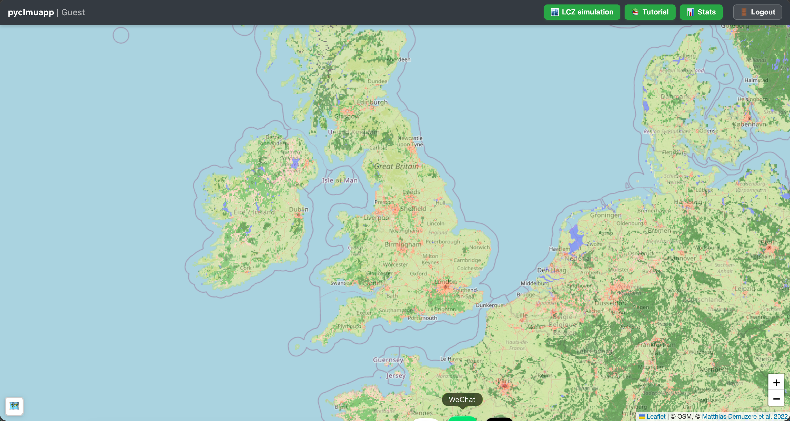

# Recommended usage
---

1 Download input data: [data](https://drive.google.com/file/d/12nCArI8FsD4JSWdMyQO8CAfgh_pdEePC/view?usp=sharing)

2 Decompression
```
pwd
tar -zxvf surface.tar.gz

```

3 Pull
```
docker pull junjieyu/clmuweb:laest
```

4 Run
```
# surface is the data dir of step 1&2
docker run \
  -p 8080:8080 \
  -v "$(pwd)/surface:/app/surface" \
  --name clmuweb-container \
  junjieyu/clmuweb:latest
# then open http://localhost:8080/ or http://localhost:8080/.
```

successful Web interface will look like:



5 Remove
```
docker rm clmuweb-container
```