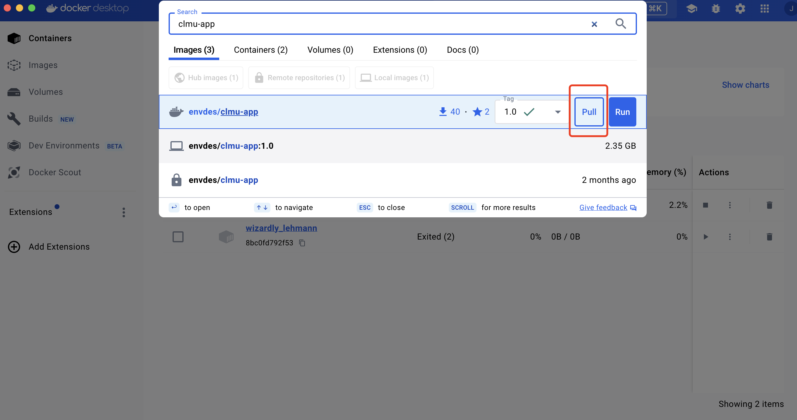
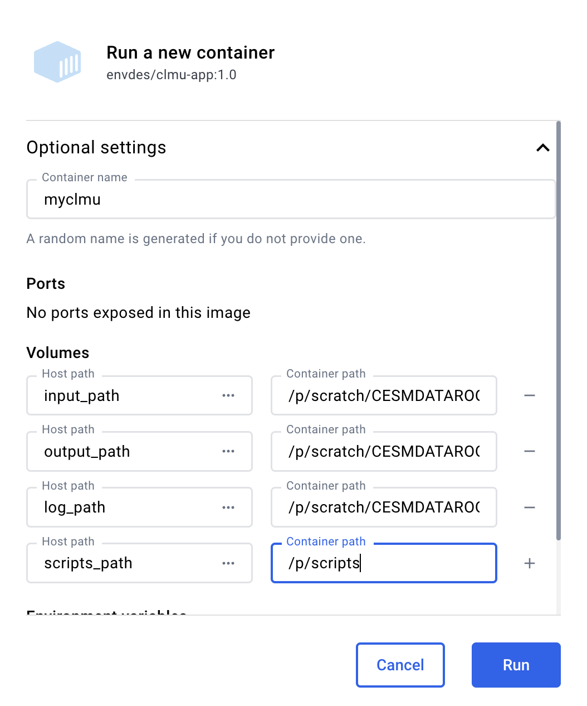
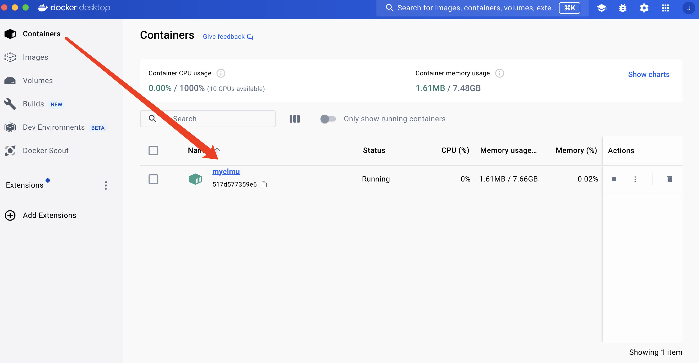

# Run CLMU-App

---

There are three ways to run the container. (If you have [Apptainer](https://apptainer.org/)/[Singularity](https://docs.sylabs.io/guides/3.7/user-guide/), no need to do follows)

## 1 pyclmuapp

---

**Note**: install docker before using pyclmuapp

- [Install Docker on Linux](https://docs.docker.com/desktop/setup/install/linux/)
- [Install Docker on Mac](https://docs.docker.com/desktop/setup/install/mac-install/)
- [Install Docker on Windows](https://docs.docker.com/desktop/setup/install/windows-install/)

- The inputfolder, outputfolder, logfolder, and scriptfolder will be checked in the current working directory.
- If the folder does not exist, it will be created.
- User can specify the folders by using the inputfolder, outputfolder, logfolder, and scriptfolder parameters.
- Inputfolder, outputfolder, logfolder, and scriptfolder parameters are optional.


Two way to create a docker container for pyclmuapp

1 Bash command
```bash
$ pyclmuapp --has_container False --container_type docker --init True
```

2 Python
```
from pyclmuapp import container as c
import os
o = c.clumapp(pwd=os.getcwd())

# this will pull the image to local
o.docker(cmd="pull", cmdlogfile="None",)

# run the image
o.docker(cmd="run", cmdlogfile="None",)
```

if you have had the inputfolder, outputfolder, logfolder, and scriptfolder, then use

```
from pyclmuapp import container as c
o = c.clumapp(
        pwd=None,
        input_path="your input_path",
        output_path="your output_path",
        log_path="your log_path",
        scripts_path = "your scripts_path")

# this will pull the image to local
o.docker(cmd="pull", cmdlogfile="None",)

# run the image
o.docker(cmd="run", cmdlogfile="None",)
```

## 2 Docker Desktop

**2.1 Pull clmu-app imgae** 



**2.2 Run clmu-app**


**bind the host path to the container path**

1. container name: myclmu
2. input_path:/p/scratch/CESMDATAROOT/inputdata 
3. output_path:/p/scratch/CESMDATAROOT/Archive/lnd/hist
4. log_path:/p/scratch/CESMDATAROOT/CaseOutputs 
5. scripts_path:/p/scripts
   


then your can find your container




## 3 Command line
---

```
docker pull envdes/clmu-app:1.0

export input_path=your_input_path
export output_path=your_output_path
export log_path=your_log_path
export scripts_path=your_scripts_path

docker run --hostname clmu-app \
-v ${input_path}:/p/clmuapp \
-v ${output_path}:/p/scratch/CESMDATAROOT/Archive \
-v ${log_path}:/p/scratch/CESMDATAROOT/CaseOutputs \
-v ${scripts_path}:/p/scripts -itd --name myclmu envdes/clum-app
```